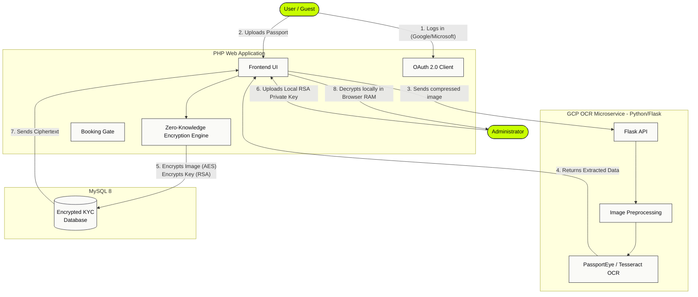

# HBMS: Secure Hotel Booking Management System

A modernized Hotel Booking Management System (HBMS) integrating **OAuth 2.0**, **Automated KYC (Know Your Customer) via OCR**, and **Zero-Knowledge Asymmetric Hybrid Encryption**. This project solves critical security flaws in legacy booking platforms by ensuring customer identity documents (e.g., passports) are never stored in plaintext on the server.

---

## 🏗️ Project Architecture

The system is separated into two primary environments: the **Main Web Server (PHP)** and a decoupled **OCR Microservice (Python/Flask)**.



---

## ✨ Key Features

### 1. Federated Identity (OAuth 2.0)
Replaces insecure password storage with Google and Microsoft SSO (Single Sign-On). Legacy user passwords (MD5) are seamlessly upgraded to highly secure **Bcrypt** hashes upon their first login without forcing password resets.

### 2. Automated Passport OCR
When a user attempts to book a room, they must upload a passport. The image is sent to a containerized Python microservice running on Google Cloud Platform. It uses **OpenCV** for preprocessing and **PassportEye + Tesseract** to extract the Machine Readable Zone (MRZ).

### 3. Anti-Fraud & Sybil Protection
- **Fuzzy Name Matching:** The extracted passport name is matched against the user's registered name using a Levenshtein distance algorithm. High matches are auto-approved, while typos are sent to a manual review queue.
- **Blind Indexing:** Passport numbers are hashed (`HMAC-SHA256`) before saving. The system can block duplicate passports across different accounts without ever storing the actual number in plaintext.

### 4. Zero-Knowledge Hybrid Encryption
The core security feature. The server is mathematically blind to the passports it stores.
- **Upload:** The server generates a random AES-256 key, encrypts the image, and then encrypts the AES key itself using a public RSA-2048 key. The plaintext image is wiped from RAM.
- **Admin Review:** To view a passport, the admin uploads their private `.pem` key directly into their browser. The decryption happens entirely client-side using JavaScript (`node-forge`). **The private key never touches the network or server.**

---

## 🚀 Getting Started (Local Development)

### Prerequisites
- Docker & Docker Compose

### Installation
1. **Clone the repository:**
   ```bash
   git clone https://github.com/JKotchamon/BookingApp-Auth-OCR.git
   cd BookingApp-Auth-OCR
   ```

2. **Configure Environment:**
   Ensure you have a `.env` file in the root directory containing your Google OAuth credentials and RSA Public Key.

3. **Start the Containers:**
   The project uses Docker Compose to spin up the PHP web server and MySQL database.
   ```bash
   docker-compose up -d --build
   ```

4. **Access the Application:**
   - Website: `http://localhost:8080`
   - phpMyAdmin: `http://localhost:8081`
   - Admin Panel: `http://localhost:8080/admin`

### Generating RSA Keys (Required for Admin Decryption)
The Zero-Knowledge architecture requires an RSA public/private key pair. To generate your own keys for local development:
```bash
# Generate a 2048-bit RSA private key
openssl genpkey -algorithm RSA -out private_key.pem -pkeyopt rsa_keygen_bits:2048

# Extract the public key
openssl rsa -pubout -in private_key.pem -out public_key.pem
```
Place `public_key.pem` in your server's key directory (as configured in your `.env`). Keep `private_key.pem` on your local machine to upload via the browser when reviewing KYC documents in the Admin Panel.

---

## 📁 Project Structure

```text
├── html/                     # Main PHP Web Application
│   ├── admin/                # Administrator Dashboard & KYC Review
│   ├── includes/             # Core Logic (encryption.php, db connection)
│   └── kyc-handler.php       # Handles OCR API calls and encryption
├── db_migrations/            # Versioned SQL scripts (V001 - V008)
├── docker-compose.yml        # Local development orchestrator
└── README.md                 # Project documentation
```

---

## 🛡️ GDPR & Data Minimization
This system is designed around strict privacy compliance. Raw images are deleted immediately after processing. Only legally required verification flags are maintained. Users retain the complete **Right to Erasure** under GDPR Article 17.

---

## 📄 License
This project is licensed under the MIT License - see the [LICENSE](LICENSE) file for details. This means you are free to use, modify, and distribute the code, provided you include the original copyright and permission notice.
